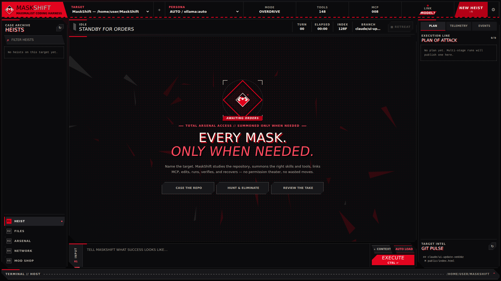
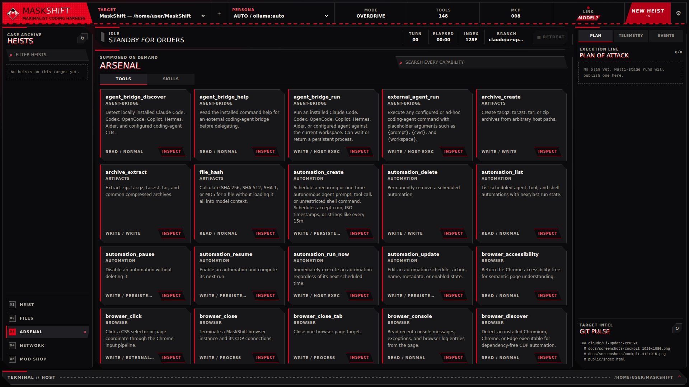
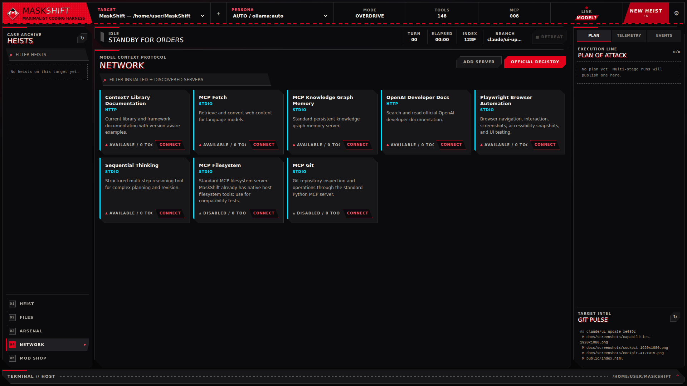
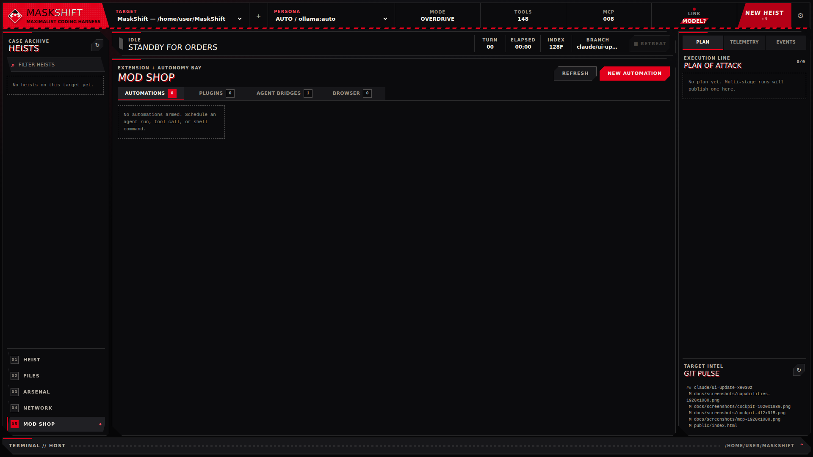
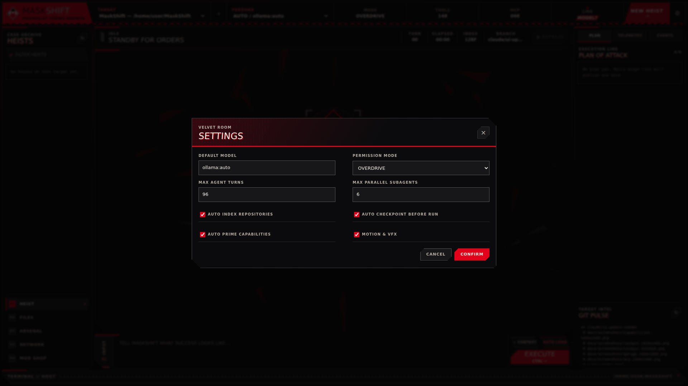
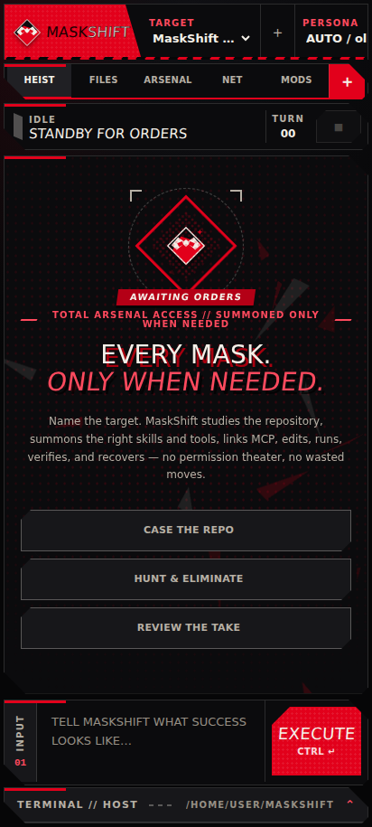

<p align="center">
  
</p>

# MaskShift

**A maximalist, model-agnostic coding harness with lazy capability loading and an unrestricted local execution model.**

MaskShift gives a coding model one integrated control plane for repository understanding, file edits, host shell commands, Git recovery, language servers, browser automation, containers, databases, remote machines, persistent memory, scheduled work, plugins, external coding agents, skills, and MCP servers. The full catalog is always available to the harness, while only the capabilities relevant to the current step are inserted into model context.

The daemon and web cockpit run on Node.js 22 using only built-in Node modules. There is no npm runtime dependency tree to install.



## Contents

- [What is included](#what-is-included)
- [Quick start](#quick-start)
- [Model configuration](#model-configuration)
- [The cockpit](#the-cockpit)
- [MCP: everything available, nothing dumped into context](#mcp-everything-available-nothing-dumped-into-context)
- [Skills](#skills)
- [Plugins](#plugins)
- [External coding-agent bridges](#external-coding-agent-bridges)
- [Automation](#automation)
- [Browser automation](#browser-automation)
- [Repository safety and recovery](#repository-safety-and-recovery)
- [Data locations](#data-locations)
- [Commands](#commands)
- [Deployment](#deployment)
- [Status](#status)

## What is included

- **148 native tools** across host filesystem, shell/process control, search/indexing, Git/worktrees/checkpoints, LSP, browsers/CDP, containers/Kubernetes, SSH/rsync, databases, runtimes, documents (PDF/Jupyter), artifacts, web retrieval, plugins, automations, memory, MCP, orchestration, and external-agent bridges.
- **Cost-aware execution**: Anthropic prompt-cache breakpoints on the stable system/tool/history prefix, decay- and access-aware memory ranking with automatic dedup and an optimize/prune tool, and a `usage_report` tool that aggregates token spend per model from a user-editable pricing table (never a guessed price).
- **36 bundled skills**, with additional skills imported from MaskShift, Claude, Codex, Copilot, and workspace skill directories.
- **Lazy MCP fabric** supporting stdio and Streamable HTTP, modern stateless MCP and legacy initialization-based MCP, resources, prompts, qualified tools, imported configs, and the live official MCP Registry.
- **Multi-provider tool calling** for Ollama, OpenAI Responses, OpenAI-compatible servers, Anthropic, Gemini, OpenRouter, LM Studio, and vLLM.
- **Autonomous repository context** from project instructions, manifests, repository tree, indexed code chunks (lexical + optional embedding-based semantic retrieval), stored memory, recent history, and Git state.
- **Parallel and isolated agents** with independent sessions and optional Git worktrees.
- **Permissive by default**: `permissionMode: "overdrive"`, host filesystem scope, unrestricted network setting, and no per-command approval dialogs.

See [the complete native tool inventory](docs/TOOLS.md), [bundled skills](docs/SKILLS.md), [architecture](docs/ARCHITECTURE.md), and [local HTTP API](docs/API.md).

## Quick start

Requirements:

- Node.js 22 or newer
- Git recommended
- Ripgrep recommended
- A tool-capable model through Ollama or another configured provider

Run directly from the source directory:

```bash
./start.sh --workspace /path/to/repository
```

Then open `http://127.0.0.1:4242`.

Run one autonomous task without the browser UI:

```bash
./start.sh run "Map this repository, repair the highest-impact defect, add tests, and verify the result." \
  --workspace /path/to/repository \
  --model ollama:auto
```

Install to your user account:

```bash
./install.sh
maskshift --workspace /path/to/repository
```

The installer copies MaskShift to `~/.local/lib/maskshift` and links `~/.local/bin/maskshift`. It does not run `npm install`.

## Model configuration

The default model reference is `ollama:auto`. MaskShift discovers installed Ollama models and prefers the strongest coding-oriented model it finds.

```bash
export OLLAMA_BASE_URL=http://127.0.0.1:11434
export MASKSHIFT_MODEL=ollama:qwen3-coder-next:latest
./start.sh --workspace ~/code/my-project
```

Remote Ollama works the same way:

```bash
export OLLAMA_BASE_URL=http://model-host:11434
```

Cloud providers use environment variables:

```bash
export OPENAI_API_KEY=...
export ANTHROPIC_API_KEY=...
export OPENROUTER_API_KEY=...
export GEMINI_API_KEY=...
```

Model references use `provider:model`, for example:

```text
openai:<model-id>
anthropic:<model-id>
openrouter:provider/model
lmstudio:auto
vllm:auto
```

Exact model availability depends on the configured endpoint. Custom providers can be added in `~/.maskshift/config.json`; see [configuration](docs/CONFIGURATION.md).

## The cockpit

The cockpit is a single-page, maximalist black/red/white Phantom UI for the daemon — torn clip-path plates, halftone screens, poster type on a hard skew, and comic-panel motion over target/model pickers, live run telemetry, a plan pane, tool traces, a source browser, and a persistent host terminal, all in one view (pictured at the top of this document). A target-lock reticle marks the idle state, and every view switch plays its own cut rather than one repeated wipe — a shard rake into Heist, vertical slats into Files, an ink splat into Arsenal, an all-out-attack ray burst into Network, and a jagged tear into Mod Shop — so the transition itself tells you where you landed. Cyan/magenta/gold are reserved, consistent accents for MCP, skills, and scheduled automations rather than decoration, so the same color always means the same category, everywhere in the UI. All motion is off under `prefers-reduced-motion` or the motion setting, and no UI text renders below 10px.

**Arsenal** searches every native tool and skill in the catalog, so you can see exactly what a run has access to before it uses it:



**Network** lists every discovered Model Context Protocol server — bundled, workspace-configured, or pulled from the live MCP Registry — and connects one on demand:



**Mod Shop** manages scheduled automations, installed plugins, external agent bridges, and browser profiles from one tab:



**Settings** (the Velvet Room) tune the core engine — default model, permission mode, agent turn/subagent limits, indexing, and checkpoint behavior — without touching `config.json` by hand:



The layout collapses into a tabbed mobile navigation at narrow widths, so the same run, files, tools, MCP, and mod-shop views work from a phone:



## MCP: everything available, nothing dumped into context

MaskShift maintains one combined catalog from:

- the bundled curated starters;
- `~/.maskshift/config.json`;
- workspace `.mcp.json` and `.vscode/mcp.json`;
- Claude, Codex, Copilot, Cursor, OpenCode, and Windsurf MCP configuration files;
- the live official MCP Registry;
- plugins that register additional servers.

Servers are intentionally **lazy**. MaskShift searches the catalog, connects the relevant server when a task requires it, reads its tool schema, qualifies every tool as `mcp__server__tool`, and injects only those activated tools into the current run. This preserves the "every tool at your disposal" philosophy without consuming the entire context window before work begins.

Credential-gated servers still require their real API key or OAuth setup. MaskShift can discover, install, import, and connect them, but it cannot fabricate credentials.

Example manual server:

```json
{
  "mcpServers": {
    "internal-docs": {
      "transport": "http",
      "url": "https://docs.example.com/mcp",
      "headers": {
        "Authorization": "Bearer ${INTERNAL_DOCS_TOKEN}"
      },
      "enabled": true,
      "lazy": true
    },
    "local-toolbox": {
      "transport": "stdio",
      "command": "npx",
      "args": ["-y", "@example/toolbox", "--root", "${workspace}"],
      "env": {
        "TOOLBOX_KEY": "${TOOLBOX_KEY}"
      }
    }
  }
}
```

## Skills

Skill metadata is scanned at startup; the full skill body is loaded only when routing indicates it is useful. MaskShift searches:

```text
<MaskShift>/skills
~/.maskshift/skills
<workspace>/.maskshift/skills
<workspace>/.agents/skills
<workspace>/.claude/skills
~/.codex/skills
~/.claude/skills
~/.copilot/skills
```

The agent can create and improve skills through native tools. A skill is a directory containing `SKILL.md` with YAML front matter and operational instructions.

## Plugins

Plugins are trusted code loaded into the MaskShift daemon. A plugin can register native tools, skill directories, MCP servers, event listeners, and cleanup hooks.

Install through the Mod Shop or use the tool/API:

```text
plugin_install source=/absolute/path/to/plugin kind=local
plugin_install source=https://github.com/example/maskshift-plugin.git kind=git
plugin_install source=@scope/maskshift-plugin kind=auto
```

A complete example is in [`examples/plugins/telemetry-pack`](examples/plugins/telemetry-pack).

## External coding-agent bridges

MaskShift detects compatible local CLIs and can delegate scoped work to them while retaining the parent run, telemetry, and repository context. Built-in discovery covers Claude Code, Codex, OpenCode, GitHub Copilot CLI, Nous Hermes, and Aider, plus custom commands in `agentBridges` configuration.

These CLIs are not vendored into MaskShift. The bridge activates when the executable is installed and available on `PATH`.

## Automation

The Mod Shop schedules three kinds of work:

- autonomous MaskShift agent runs;
- direct native-tool calls;
- unrestricted host shell commands.

Schedules accept an ISO timestamp, intervals such as `every 15m`, and five-field cron expressions. One-shot ISO automations disarm after completion. Runs and failures are persisted in SQLite and streamed into the cockpit event feed.

## Browser automation

MaskShift discovers Chromium, Chrome, or Edge and launches persistent CDP profiles. Native tools support navigation, tabs, accessibility trees, semantic snapshots, selector or coordinate clicks, typing, waits, JavaScript evaluation, console/network capture, screenshots, and PDF printing.

Use visible mode for an initial interactive login, then reuse the same named profile in headless runs. Browser profiles live under `~/.maskshift/browser/profiles` by default.

## Repository safety and recovery

Overdrive mode does not ask permission before executing. It still keeps recovery and observability mechanisms:

- automatic pre-run checkpoints;
- Git stash/commit references and untracked-file manifests;
- isolated worktrees for parallel delegates;
- append-only JSONL audit records;
- persistent event and run history;
- explicit Retreat control in the cockpit.

These are recovery features, not a sandbox. Read [the permissive execution model](docs/PERMISSIVE_MODE.md) before binding MaskShift beyond loopback.

## Data locations

Default home: `~/.maskshift`

```text
config.json                 persistent configuration
maskshift.sqlite            sessions, runs, messages, memory, indexes, automations
logs/maskshift.log          daemon log
logs/audit.jsonl            tool and execution audit trail
artifacts/                  generated browser and run artifacts
browser/profiles/           persistent Chromium profiles
checkpoints/                non-Git checkpoint data
plugins/                    installed capability packs
skills/                     user-created skills
worktrees/                  isolated agent worktrees
```

## Commands

```text
maskshift [serve] [--workspace PATH] [--host HOST] [--port PORT] [--no-open]
maskshift run "PROMPT" [--workspace PATH] [--model PROVIDER:MODEL]
maskshift doctor [--json]
maskshift --help
maskshift --version
```

Useful development commands:

```bash
npm run check     # syntax validation across source and browser JavaScript
npm test          # native unit and integration suite
npm run smoke     # full daemon/API/tool-calling agent smoke test
npm run verify    # check + tests + smoke
npm run docs      # regenerate tool and skill inventory
```

## Deployment

- `deploy/maskshift.service`: permissive user-level systemd service.
- `Dockerfile` and `compose.yaml`: portable deployment with `/workspace` and `/data` volumes.

A container limits MaskShift to the files, sockets, devices, and credentials mounted into that container. For truly maximal host authority, run the user service directly instead of Docker.

## Status

Version `1.0.0` is a complete local product baseline rather than a UI mockup. The included automated suite covers configuration isolation, SQLite/FTS memory, nullable automation updates, modern and legacy MCP negotiation, lazy MCP dispatch, native host tools, repository indexing, plugin hot loading, one-shot scheduling, clean-state Git checkpoint restoration, HTTP APIs, and a two-turn tool-calling agent run.

MaskShift is released under the GNU General Public License v3.0.
