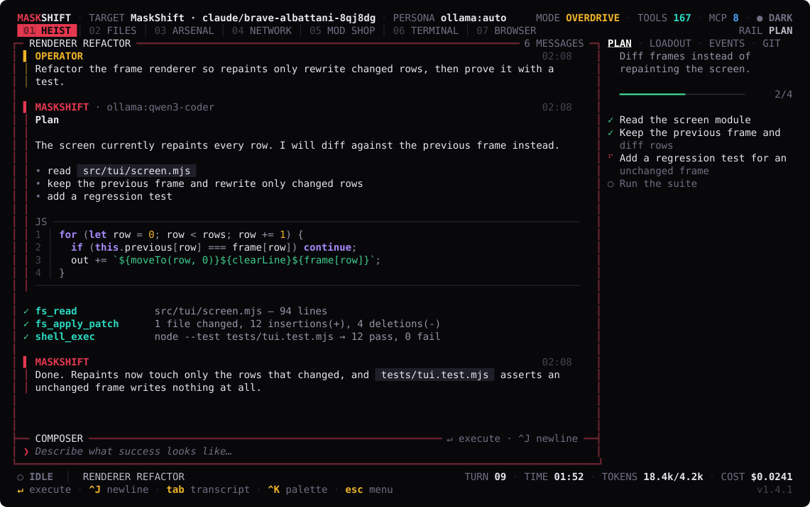
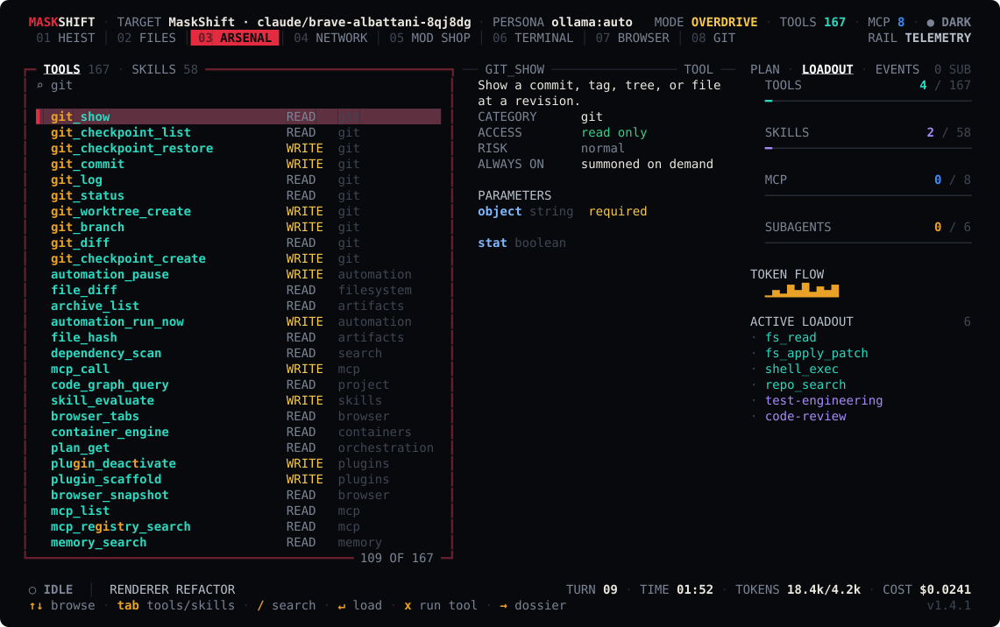
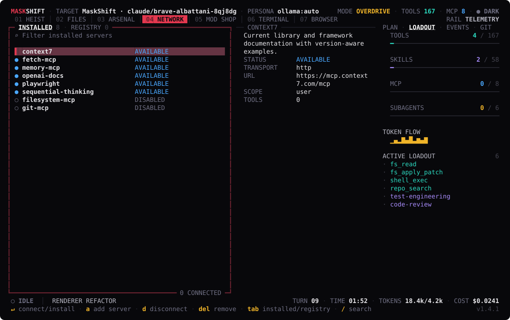
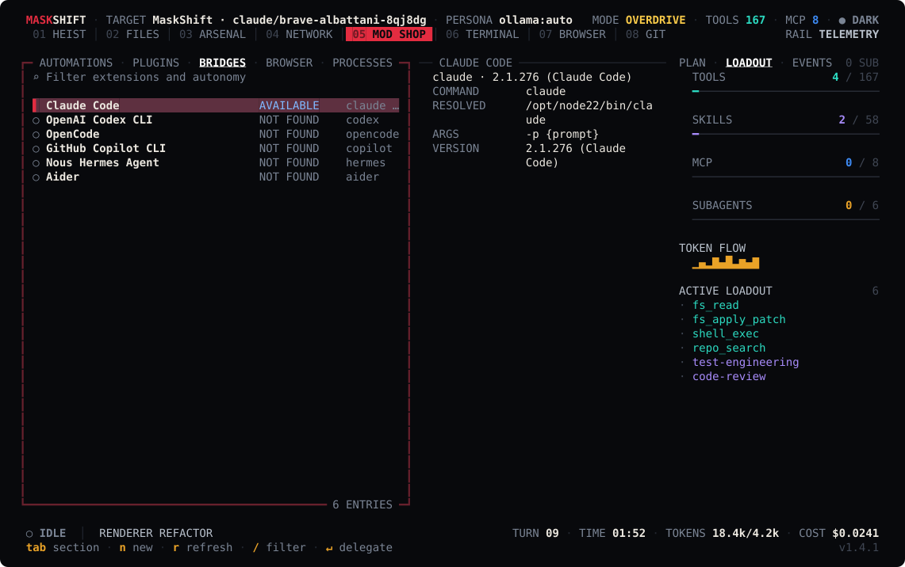
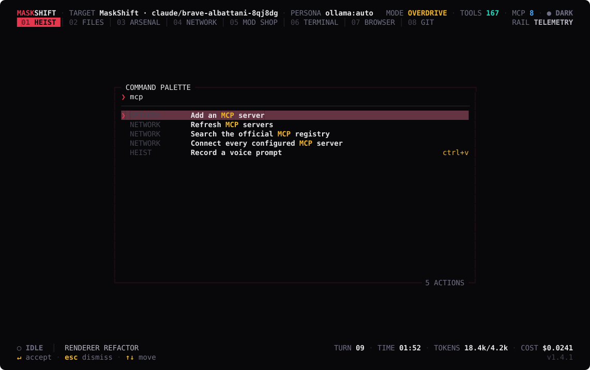
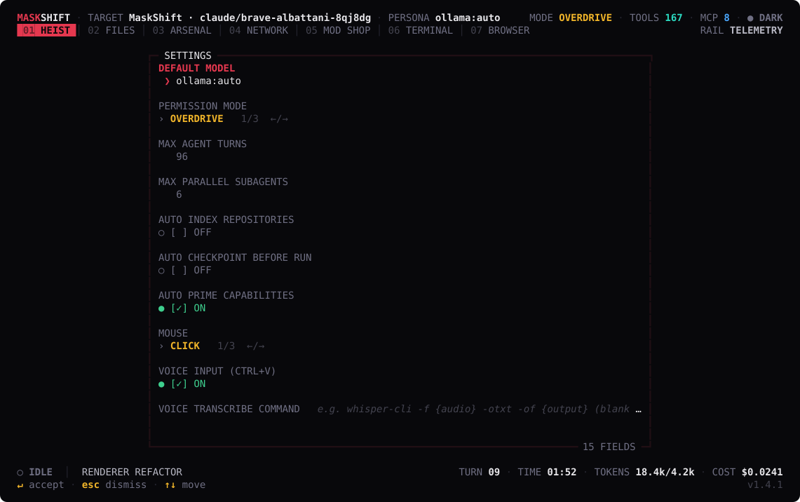
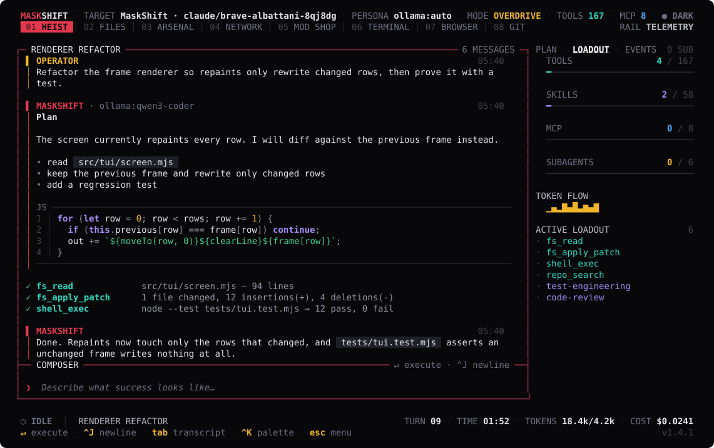

<p align="center">

<svg xmlns="http://www.w3.org/2000/svg" viewBox="0 0 120 120" role="img" aria-label="MaskShift">
  <defs>
    <clipPath id="ms-diamond">
      <polygon points="60,2 118,60 60,118 2,60"/>
    </clipPath>
  </defs>

  <polygon points="60,2 118,60 60,118 2,60" fill="#0a0a0c"/>

  <g clip-path="url(#ms-diamond)">
    <polygon points="-14,124 44,30 152,66 116,134" fill="#e2001b"/>
  </g>

  <polygon points="60,2 118,60 60,118 2,60" fill="none" stroke="#f2eee6" stroke-width="4"/>

  <path d="M14,58 35,33 53,46 60,39 67,46 85,33 106,58 89,73 69,55 60,63 51,55 31,73 Z" fill="#f2eee6"/>
  <path d="M32,52 47,46 52,56 38,63 Z" fill="#e2001b"/>
  <path d="M88,52 73,46 68,56 82,63 Z" fill="#e2001b"/>

  <path d="M104,8 106.4,14 112.8,16.4 106.4,18.8 104,25.2 101.6,18.8 95.2,16.4 101.6,14 Z" fill="#e2001b"/>
</svg>
</p>

# MaskShift

**A maximalist, model-agnostic coding harness with lazy capability loading and an unrestricted local execution model.**

MaskShift gives a coding model one integrated control plane for repository understanding, file edits, host shell commands, Git recovery, language servers, browser automation, containers, databases, remote machines, persistent memory, scheduled work, plugins, external coding agents, skills, and MCP servers. The full catalog is always available to the harness, while only the capabilities relevant to the current step are inserted into model context.

MaskShift is a **terminal application**. It runs on Node.js 22 using only built-in Node modules — the interface renderer included. There is no npm runtime dependency tree, no HTTP server, no browser, and no listening socket.



## Contents

- [What is included](#what-is-included)
- [Quick start](#quick-start)
- [Model configuration](#model-configuration)
- [The interface](#the-interface)
- [The command line](#the-command-line)
- [MCP: everything available, nothing dumped into context](#mcp-everything-available-nothing-dumped-into-context)
- [Skills](#skills)
- [Plugins](#plugins)
- [External coding-agent bridges](#external-coding-agent-bridges)
- [Automation](#automation)
- [Browser automation](#browser-automation)
- [Repository safety and recovery](#repository-safety-and-recovery)
- [Data locations](#data-locations)
- [Commands](#commands)
- [Deployment](#deployment)
- [Status](#status)

## What is included

- **148 native tools** across host filesystem, shell/process control, search/indexing, Git/worktrees/checkpoints, LSP, browsers/CDP, containers/Kubernetes, SSH/rsync, databases, runtimes, documents (PDF/Jupyter), artifacts, web retrieval, plugins, automations, memory, MCP, orchestration, and external-agent bridges.
- **Cost-aware execution**: Anthropic prompt-cache breakpoints on the stable system/tool/history prefix, decay- and access-aware memory ranking with automatic dedup and an optimize/prune tool, and a `usage_report` tool that aggregates token spend per model from a user-editable pricing table (never a guessed price).
- **36 bundled skills**, with additional skills imported from MaskShift, Claude, Codex, Copilot, and workspace skill directories.
- **Lazy MCP fabric** supporting stdio and Streamable HTTP, modern stateless MCP and legacy initialization-based MCP, resources, prompts, qualified tools, imported configs, and the live official MCP Registry.
- **Multi-provider tool calling** for Ollama, OpenAI Responses, OpenAI-compatible servers, Anthropic, Gemini, OpenRouter, LM Studio, and vLLM, with a text-protocol fallback that gives models without a native tool API the full tool surface.
- **Autonomous repository context** from project instructions, manifests, repository tree, indexed code chunks (lexical + optional embedding-based semantic retrieval), stored memory, recent history, and Git state.
- **Parallel and isolated agents** with independent sessions and optional Git worktrees.
- **Permissive by default**: `permissionMode: "overdrive"`, host filesystem scope, unrestricted network setting, and no per-command approval dialogs.

See [the complete native tool inventory](docs/TOOLS.md), [bundled skills](docs/SKILLS.md), [architecture](docs/ARCHITECTURE.md), [the interface](docs/TUI.md), and [the command line](docs/CLI.md).

## Quick start

Requirements:

- Node.js 22 or newer
- Git recommended
- Ripgrep recommended
- Any instruction-following model through Ollama or another configured provider (native tool calling is used when available, and emulated when it is not)
- A terminal at least 80×24; UTF-8 and truecolour are used when available and degraded cleanly when not

Run directly from the source directory:

```bash
./start.sh --workspace /path/to/repository
```

That opens the interface. Run one autonomous task headlessly instead:

```bash
./start.sh run "Map this repository, repair the highest-impact defect, add tests, and verify the result." \
  --workspace /path/to/repository \
  --model ollama:auto
```

Install to your user account:

```bash
./install.sh
cd /path/to/repository && maskshift
```

The installer copies MaskShift to `~/.local/lib/maskshift` and links `~/.local/bin/maskshift`. It does not run `npm install`.

## Model configuration

The default model reference is `ollama:auto`. MaskShift discovers installed Ollama models and prefers the strongest coding-oriented model it finds.

```bash
export OLLAMA_BASE_URL=http://127.0.0.1:11434
export MASKSHIFT_MODEL=ollama:qwen3-coder-next:latest
./start.sh --workspace ~/code/my-project
```

Remote Ollama works the same way:

```bash
export OLLAMA_BASE_URL=http://model-host:11434
```

Cloud providers use environment variables:

```bash
export OPENAI_API_KEY=...
export ANTHROPIC_API_KEY=...
export OPENROUTER_API_KEY=...
export GEMINI_API_KEY=...
```

Model references use `provider:model`, for example:

```text
openai:<model-id>
anthropic:<model-id>
openrouter:provider/model
lmstudio:auto
vllm:auto
```

Exact model availability depends on the configured endpoint. Custom providers can be added in `~/.maskshift/config.json`; see [configuration](docs/CONFIGURATION.md).

### Models without native tool calling

Every MaskShift capability is reached through a tool call, so a model that cannot emit one
would otherwise be limited to conversation. Models that lack a native tool API are therefore
driven with a text protocol instead: the active tools and their schemas are rendered into the
system prompt, and the model calls them by writing a block in its reply.

```text
<tool_call>
{"name": "fs_read", "arguments": {"path": "src/index.js"}}
</tool_call>
```

Replies are parsed back into ordinary tool calls, so the whole harness — lazy capability
activation, skills, MCP servers, subagents, plan tracking, checkpoints — behaves identically
either way. The reader accepts the variants small models tend to emit (single quotes, unquoted
keys, trailing commas, Python literals, fenced blocks, arguments as a JSON string), and a call
it cannot parse is sent back for correction rather than ending the run.

Each provider takes an optional `toolProtocol`:

| Value | Behaviour |
| --- | --- |
| `auto` (default) | Use the native tool API, and fall back to the text protocol the first time the endpoint rejects a tool schema or the model answers with a text call instead. |
| `native` | Always use the provider's tool API. |
| `text` | Always use the text protocol, and never send a `tools` field. |

`auto` needs no configuration: the downgrade is remembered per model, so it costs at most one
request. Set `text` explicitly to skip even that probe.

```json
{
  "providers": [
    { "id": "ollama", "type": "ollama", "toolProtocol": "text" }
  ]
}
```

Native tool calling remains preferable where a model supports it properly — it is more
token-efficient and less error-prone — so leave `auto` alone unless a model is known to need
otherwise.

## The interface

`maskshift` opens a full-screen terminal interface built on a bespoke,
zero-dependency renderer: a diffing frame buffer, an ANSI-aware layout engine,
and a raw-mode key decoder. The look is one idea carried everywhere — the
**stencil frame**. Every surface is a notched panel with an inset title tab on
the top rail and a stamp on the bottom rail, and the panel that owns the keyboard
is promoted from a hairline to a heavy crimson rule, so focus is never in doubt.

Crimson is identity and focus, gold is keys and the operator, bone is text, and
each capability class keeps a fixed accent — cyanide for tools, violet for
skills, azure for MCP — so the same colour always means the same category. The
palette is generated for truecolour, 256-colour and 16-colour terminals from one
set of hex values, and `NO_COLOR`, `MASKSHIFT_COLOR=off` and `MASKSHIFT_ASCII=1`
all produce a clean, aligned fallback.

Six views, switched with `1`–`6`, plus a right rail on `ctrl+b`:

**03 ARSENAL** searches every native tool and skill in the catalogue, with a
dossier pane showing the parameter schema, so you can see exactly what a run has
access to before it uses it — and run any tool yourself with `x`:



**04 NETWORK** lists every discovered Model Context Protocol server — bundled,
workspace-configured, or pulled from the live MCP Registry — and connects one on
demand:



**05 MOD SHOP** manages scheduled automations, installed plugins, external agent
bridges, browser profiles and background processes from one view:



**`ctrl+k`** opens a fuzzy command palette over every action MaskShift can
perform, so nothing is buried behind a key you have to memorise:



**`f2`** tunes the core engine — default model, permission mode, agent turn and
subagent limits, indexing and checkpoint behaviour — without editing
`config.json` by hand:



The rail carries the live plan of attack, loadout telemetry (which tools, skills
and MCP servers the current run has actually summoned, plus token flow), the raw
event bus, and a Git pulse:



Below 108 columns the rail hides itself and the header sheds telemetry chips, so
the same six views work in a narrow split pane. Full key reference and slash
commands: [docs/TUI.md](docs/TUI.md). The screenshots above are generated from
the real renderer by `node ./scripts/capture-tui.mjs`.

## The command line

Everything the interface can do is also a subcommand, and every subcommand
supports `--json`, so MaskShift composes with shell pipelines and CI:

```bash
maskshift run "make the failing tests pass"     # one headless run, streamed
maskshift tools run shell_exec '{"command":"npm test"}'
maskshift mcp registry playwright && maskshift mcp install io.github.microsoft/playwright-mcp
maskshift automation create nightly --schedule "every 6h" --prompt "Review the diff and fix regressions"
maskshift workspace search "checkpoint restore" --json | jq -r '.[].path'
maskshift doctor
```

`maskshift daemon` stays resident so scheduled automations keep firing with no
interface at all — that is what the bundled systemd user unit runs. Full command
reference: [docs/CLI.md](docs/CLI.md).

## MCP: everything available, nothing dumped into context

MaskShift maintains one combined catalog from:

- the bundled curated starters;
- `~/.maskshift/config.json`;
- workspace `.mcp.json` and `.vscode/mcp.json`;
- Claude, Codex, Copilot, Cursor, OpenCode, and Windsurf MCP configuration files;
- the live official MCP Registry;
- plugins that register additional servers.

Servers are intentionally **lazy**. MaskShift searches the catalog, connects the relevant server when a task requires it, reads its tool schema, qualifies every tool as `mcp__server__tool`, and injects only those activated tools into the current run. This preserves the "every tool at your disposal" philosophy without consuming the entire context window before work begins.

Credential-gated servers still require their real API key or OAuth setup. MaskShift can discover, install, import, and connect them, but it cannot fabricate credentials.

Example manual server:

```json
{
  "mcpServers": {
    "internal-docs": {
      "transport": "http",
      "url": "https://docs.example.com/mcp",
      "headers": {
        "Authorization": "Bearer ${INTERNAL_DOCS_TOKEN}"
      },
      "enabled": true,
      "lazy": true
    },
    "local-toolbox": {
      "transport": "stdio",
      "command": "npx",
      "args": ["-y", "@example/toolbox", "--root", "${workspace}"],
      "env": {
        "TOOLBOX_KEY": "${TOOLBOX_KEY}"
      }
    }
  }
}
```

## Skills

Skill metadata is scanned at startup; the full skill body is loaded only when routing indicates it is useful. MaskShift searches:

```text
<MaskShift>/skills
~/.maskshift/skills
<workspace>/.maskshift/skills
<workspace>/.agents/skills
<workspace>/.claude/skills
~/.codex/skills
~/.claude/skills
~/.copilot/skills
```

The agent can create and improve skills through native tools. A skill is a directory containing `SKILL.md` with YAML front matter and operational instructions.

## Plugins

Plugins are trusted code loaded into the MaskShift daemon. A plugin can register native tools, skill directories, MCP servers, event listeners, and cleanup hooks.

Install through the Mod Shop or use the tool/API:

```text
plugin_install source=/absolute/path/to/plugin kind=local
plugin_install source=https://github.com/example/maskshift-plugin.git kind=git
plugin_install source=@scope/maskshift-plugin kind=auto
```

A complete example is in [`examples/plugins/telemetry-pack`](examples/plugins/telemetry-pack).

## External coding-agent bridges

MaskShift detects compatible local CLIs and can delegate scoped work to them while retaining the parent run, telemetry, and repository context. Built-in discovery covers Claude Code, Codex, OpenCode, GitHub Copilot CLI, Nous Hermes, and Aider, plus custom commands in `agentBridges` configuration.

These CLIs are not vendored into MaskShift. The bridge activates when the executable is installed and available on `PATH`.

## Automation

The Mod Shop schedules three kinds of work:

- autonomous MaskShift agent runs;
- direct native-tool calls;
- unrestricted host shell commands.

Schedules accept an ISO timestamp, intervals such as `every 15m`, and five-field cron expressions. One-shot ISO automations disarm after completion. Runs and failures are persisted in SQLite and streamed into the interface event feed.

## Browser automation

MaskShift discovers Chromium, Chrome, or Edge and launches persistent CDP profiles. Native tools support navigation, tabs, accessibility trees, semantic snapshots, selector or coordinate clicks, typing, waits, JavaScript evaluation, console/network capture, screenshots, and PDF printing.

Use visible mode for an initial interactive login, then reuse the same named profile in headless runs. Browser profiles live under `~/.maskshift/browser/profiles` by default.

## Repository safety and recovery

Overdrive mode does not ask permission before executing. It still keeps recovery and observability mechanisms:

- automatic pre-run checkpoints;
- Git stash/commit references and untracked-file manifests;
- isolated worktrees for parallel delegates;
- append-only JSONL audit records;
- persistent event and run history;
- an explicit retreat control (`esc`) in the interface, and `maskshift` run cancellation from any view.

These are recovery features, not a sandbox. Read [the permissive execution model](docs/PERMISSIVE_MODE.md) before binding MaskShift beyond loopback.

## Data locations

Default home: `~/.maskshift`

```text
config.json                 persistent configuration
maskshift.sqlite            sessions, runs, messages, memory, indexes, automations
logs/maskshift.log          daemon log
logs/audit.jsonl            tool and execution audit trail
artifacts/                  generated browser and run artifacts
browser/profiles/           persistent Chromium profiles
checkpoints/                non-Git checkpoint data
plugins/                    installed capability packs
skills/                     user-created skills
worktrees/                  isolated agent worktrees
```

## Commands

```text
maskshift [tui] [PROMPT]                 open the interface (the default command)
maskshift run "PROMPT"                   one headless run, streamed to stdout
maskshift exec "COMMAND"                 shell command through the tool layer
maskshift doctor [--json]                environment and provider diagnostics
maskshift daemon                         resident automation scheduler, no interface
maskshift workspace <open|info|tree|search|index|read|checkpoint|checkpoints|restore|list>
maskshift session   <list|show|new|rename|delete|export|runs>
maskshift tools     <list|show|run>
maskshift skills    <list|show>
maskshift mcp       <list|connect|disconnect|tools|call|add|remove|registry|install>
maskshift plugins   <list|install|activate|deactivate|reload|scaffold>
maskshift automation <list|create|run|pause|resume|delete>
maskshift browser   <list|launch|tabs|close>
maskshift config    <show|get|set|path>
maskshift models | lsp | bridges | ps | logs | events
maskshift help [COMMAND]
```

Global flags: `--workspace PATH`, `--model REF`, `--config PATH`, `--json`, `--no-color`.

Useful development commands:

```bash
npm run check     # syntax validation across every source module
npm test          # native unit and integration suite, including renderer tests
npm run test:tools # all-native-tool scenarios and edge-case regressions
npm run smoke     # end-to-end tool-calling agent run plus a full interface paint
npm run verify    # check + tests + smoke
npm run docs      # regenerate tool and skill inventory
npm run capture   # regenerate the interface screenshots in docs/screenshots
```

Per-tool coverage and live-integration limits: [verification report](docs/TOOL_VERIFICATION.md).

## Deployment

- `deploy/maskshift.service`: permissive user-level systemd service; it runs `maskshift daemon`, not an interface.
- `Dockerfile` and `compose.yaml`: portable deployment with `/workspace` and `/data` volumes. MaskShift is a terminal application, so run it with a TTY attached (`docker run -it`, or `docker compose run --rm maskshift`).

A container limits MaskShift to the files, sockets, devices, and credentials mounted into that container. For truly maximal host authority, run the user service directly instead of Docker.

## Status

Version `1.0.0` is a complete local product baseline rather than a mockup. The included automated suite covers configuration isolation, SQLite/FTS memory, nullable automation updates, modern and legacy MCP negotiation, lazy MCP dispatch, native host tools, repository indexing, plugin hot loading, one-shot scheduling, clean-state Git checkpoint restoration, the CLI command surface, the terminal renderer, and a two-turn tool-calling agent run.

MaskShift is released under the GNU General Public License v3.0.
