# MaskShift Interface

`maskshift` opens a full-screen terminal interface built on a bespoke,
zero-dependency renderer: a diffing frame buffer, an ANSI-aware layout engine,
a raw-mode key decoder, and an SGR mouse decoder with per-frame hit testing.
Nothing is fetched, nothing is served, and there is no browser anywhere in the
stack.

## The design system

`src/tui/tokens.mjs` holds every colour, every measurement and every rule about
when to use them. Views import meaning — "this is destructive", "this is a
secondary label" — never a hex value, so the whole interface moves together when
one token does. `theme.mjs` is only the renderer that puts those tokens on the
wire.

### Rules of use

| Token | Means | Never |
|---|---|---|
| **crimson** `#E32C40` | Identity and focus: the wordmark, the active view tab, the pane holding the keyboard | A data value, or a severity |
| **gold** `#E9A227` | The user: their turn, their keys, their pending input | A status |
| **danger** `#FF6B4A` | Failure and destruction, and nothing else | Confused with crimson |
| **tool / skill / mcp** | Capability classes, constant across every view | Reused for state |
| **neutrals** | Everything else | — |

Two consequences are worth stating outright, because breaking either is what
made earlier revisions read as noise:

- **Exactly one filled chip per screen** — the active view tab. Panels label
  their top rail with plain text and show focus through the frame alone. When
  panels drew chips too, the top-left corner stacked the wordmark, the active
  tab and the panel title in three consecutive rows and none of them read as
  "you are here". A modal's primary action is the single exception.
- **Everything is written in ordinary sentence case.** Weight and colour, not
  capitals, carry the hierarchy, so model headings are never shouted back at the
  user from inside a quiet panel.

### The grid

Every content row in every pane is `SPACE.gutter` columns of marker followed by
text. A speaker rail, a status tick, a bullet, a tree glyph and a plain
paragraph therefore all put their first character on the same column — which is
the invariant `tests/tui.test.mjs` now asserts directly. The transcript used to
have four different left edges inside one pane.

### Motion

`src/tui/motion.mjs` drives every moving part off one wall clock, so the
interface looks the same at 8fps over SSH as it does locally, and a headless
render freezes all of it at once for reproducible captures. Nothing animates for
decoration; each animation answers a question:

| Motion | Answers |
|---|---|
| A breathing lamp | Is this still alive? |
| A highlight sweeping the focused pane's top rail | Is it working, or stuck? |
| Toasts fading in and out | Did I miss that? |
| An inline spinner beside a named call | Which step is in flight? |

### Status

`src/tui/status.mjs` collapses every subsystem's state string — runs, plan
steps, MCP servers, automations, bridges, processes, tool results — onto seven
kinds, each fixing a tone and a glyph. A failed run, a failed plan step and a
failed tool are now the same red and the same mark.

### Graceful degradation

Truecolor, 256-colour and 16-colour palettes are generated from the same hex
values. `NO_COLOR`, `MASKSHIFT_COLOR=off` and dumb terminals get clean
monochrome; `MASKSHIFT_ASCII=1` swaps every box-drawing glyph for ASCII.

## Layout

```
 MaskShift · Workspace Documents · main · Model ollama:auto   Mode Autonomous · Tools 183 · Skills 59 · ● Online
  1 Chat │ 2 Files │ 3 Capabilities │ 4 Runtime │ 5 Browser │ 6 Git                                  Sidebar Plan
┏━ Q3 invoice summary ──────────────────────────────── 6 messages ━┓ Plan · Active · Events
┃ ▌ You                                                      14:22 ┃   Total Q3 invoices by vendor.
┃ │ Go through the PDFs in ~/Documents/Invoices and total …        ┃
┃                                                                  ┃   ━━━━━━━━━━──────────  2/4
┃ ▌ MaskShift · anthropic:claude-sonnet-5                    14:22 ┃
┃ │ There are 23 PDFs. I will extract the vendor and amount …      ┃ ✓ Read every invoice
┃                                                                  ┃ ✓ Group the amounts by vendor
┃ ✓ fs_list           ~/Documents/Invoices — 23 files              ┃ ⠙ Write the spreadsheet
┣━━━━━━━━━━━━━━━━━━━━━━━━━━━━━ ↵ execute · ^J newline ━━━━━━━━━━━━━┫ ○ Check the totals
┃ ❯ Ask anything, or describe a task…                              ┃
┗━━━━━━━━━━━━━━━━━━━━━━━━━━━━━━━━━━━━━━━━━━━━━━━━━━━━━━━━━━━━━━━━━━┛
 ○ Idle  │  Q3 invoice summary           Turn 07 · Time 01:32 · Tokens 12.4k/3.1k · Cost $0.02
 ↵ execute · ^J newline · tab transcript · ^K palette · esc menu                          v1.4.1
```

The view's name appears once, in the tab strip. A panel's top rail carries what
the tab cannot — the chat's title, the shell's directory, a catalogue's
section switcher — and the frame beneath it carries focus. Panes that sit next
to each other share a single rule rather than each drawing their own: the chat
view is one frame split by an internal divider, and the sidebar and detail panes
have no frame at all.

The sidebar hides itself below 108 columns and the header sheds telemetry from
the left of its right-hand group as the terminal narrows, so the interface stays
usable at 80×24.

## Views

| View | What it holds |
|---|---|
| **Chat** | The conversation and composer. Markdown, syntax-tinted code fences, coloured diffs, collapsed tool calls, and a live indicator for in-flight tools. |
| **Files** | Workspace tree with fold state and a syntax-highlighted preview. `a` attaches the selected file to the composer. |
| **Capabilities** | Every native tool and skill, MCP servers (installed and the official registry), plugins and agent bridges — one catalogue behind five tabs, fuzzy-searchable, with a details pane per kind. `x` runs a tool directly. |
| **Runtime** | The host shell, running with your full account permissions, plus automations, background processes and browser instances behind a secondary tab strip. |
| **Browser** | A live, clickable, typeable view of a running browser tab — the same CDP connection the browser tools drive — with its own instance strip to pick which tab it watches. When the agent needs you for a step (a CAPTCHA, a bank prompt) the view opens with a "Your turn" banner; `ctrl+e` hands the browser back, `ctrl+x` cancels. |
| **Git** | Working tree changes, commit log, branches, stash, MaskShift checkpoints and worktrees, each with their own actions — plus push/pull/fetch from any tab. |

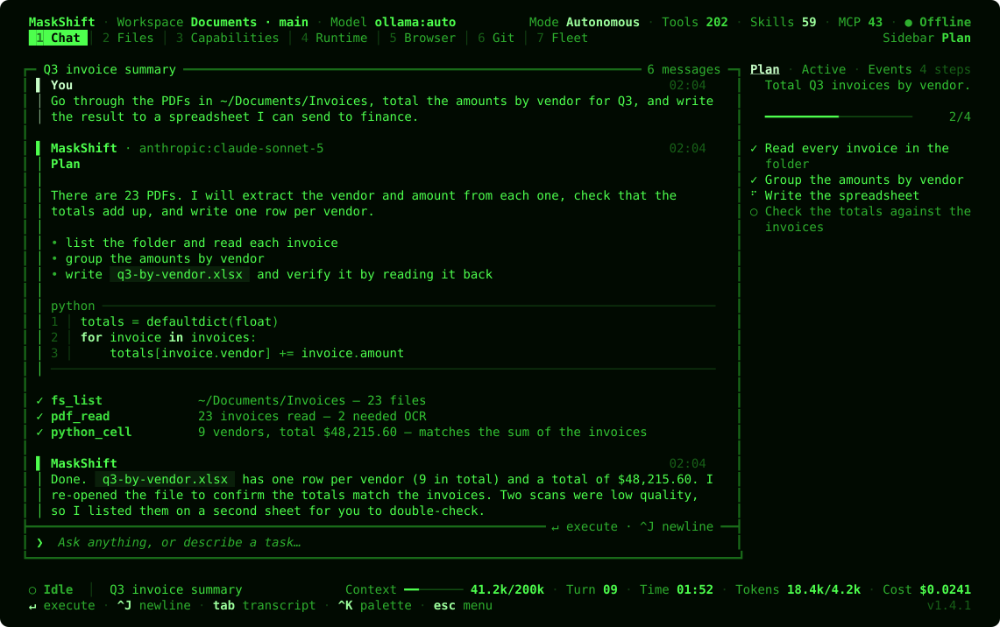

A new chat opens on a short welcome with three starter prompts (`f1`–`f3`):

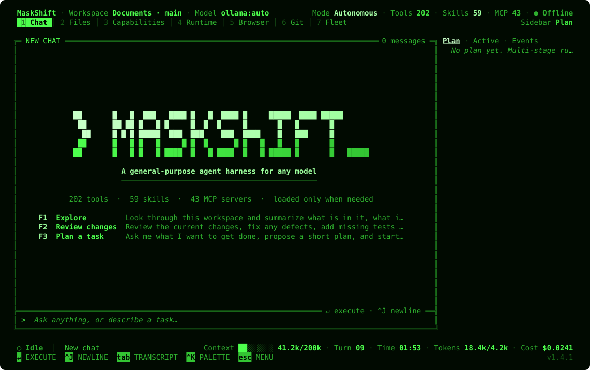

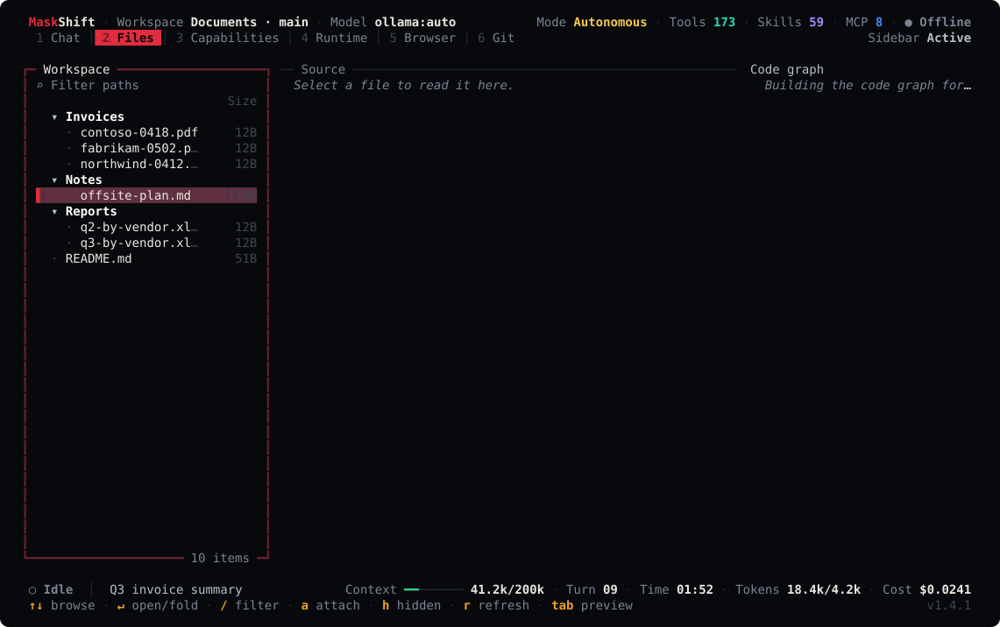

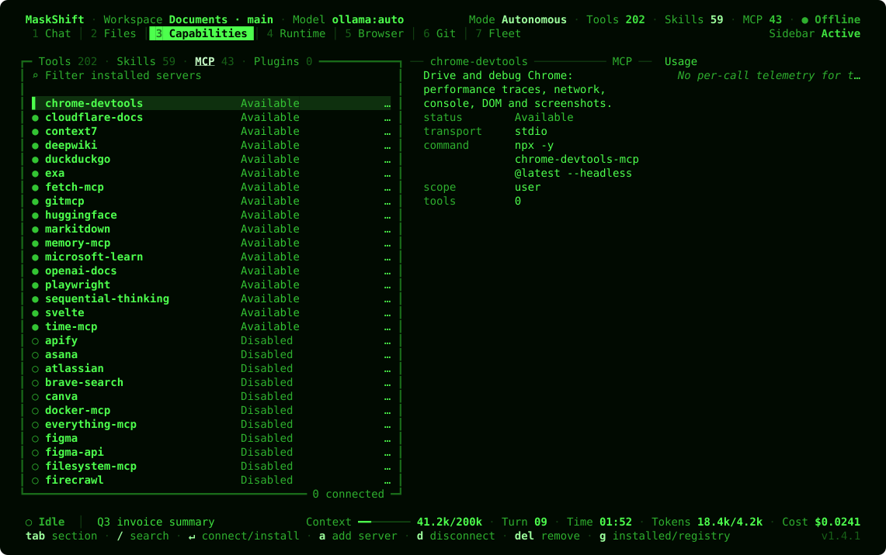

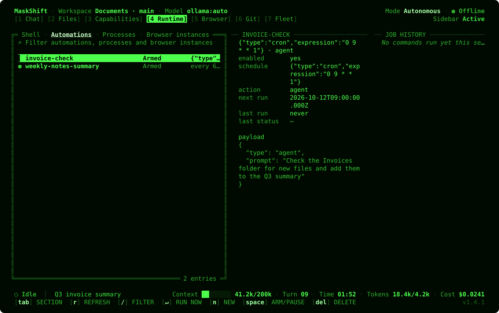

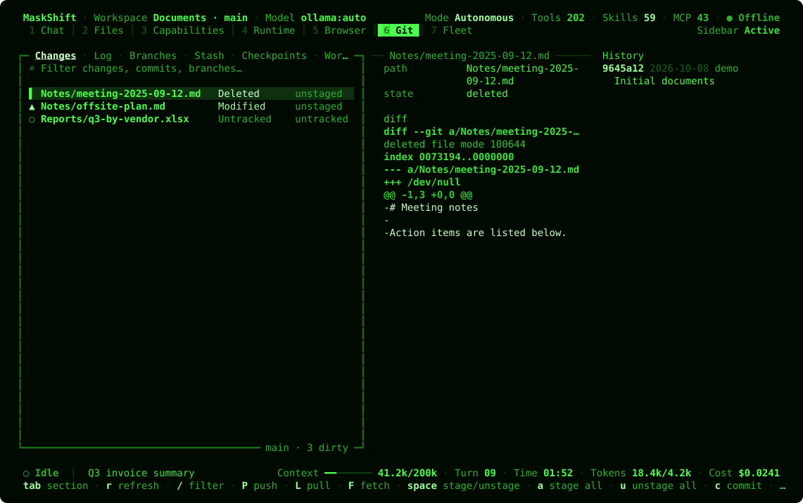

`ctrl+k` opens a fuzzy command palette over every action MaskShift can perform, so nothing is
buried behind a key you have to memorise:

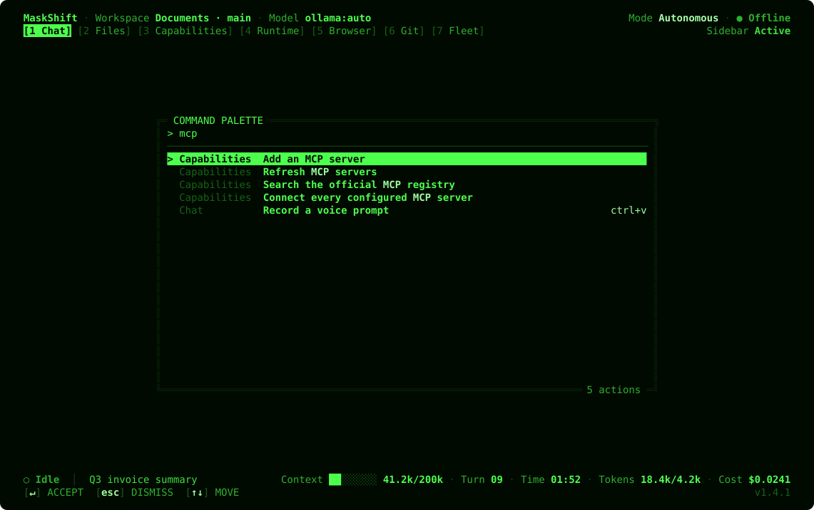

In `balanced` and `review` modes, a gated tool call shows what it will do before
it runs (see [Approving tool calls](#approving-tool-calls)):

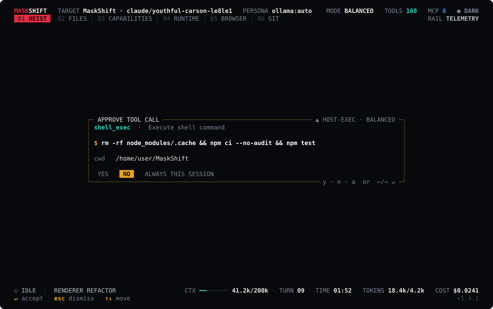

`ctrl+d` reviews everything the last run changed, diffed against the checkpoint
taken before it, and `u` undoes it:

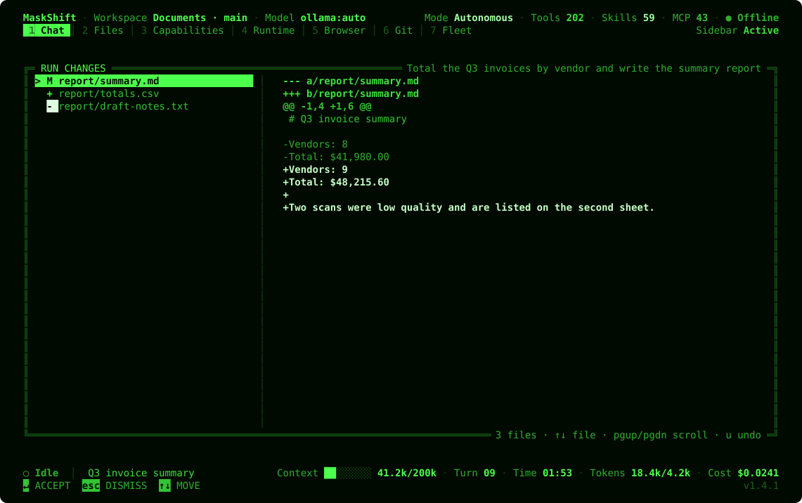

`ctrl+p` switches chats, previewing each one's goal, open issues and last
request from its saved summary:

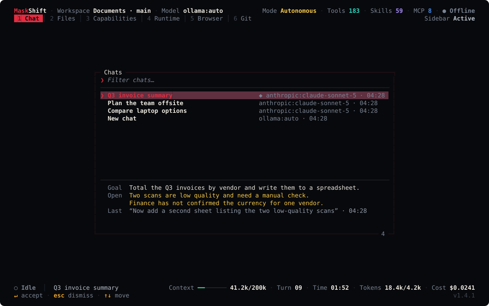

`f2` tunes the core engine — default model, permission mode, agent turn and subagent limits,
indexing and checkpoint behaviour — without editing `config.json` by hand:

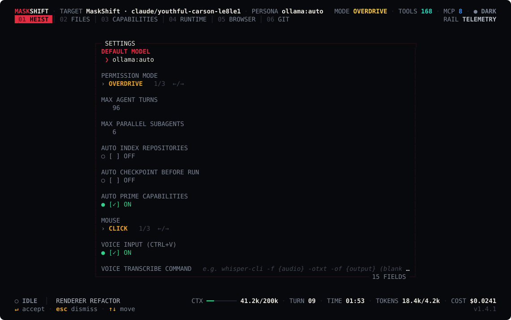

In Chat, the right sidebar carries three tabs, spelled out across a single
header row so its first line of content sits on the same screen row as the first
line of the pane it is reporting on: **Plan** (the live multi-stage plan with
progress), **Active** (which tools, skills and MCP servers the current run has
actually loaded, plus token flow) and **Events** (the raw runtime feed). Every
other view gets the same slot for its own context instead — the selected file's
outline and relationships on **Files**, a capability's usage on
**Capabilities**, exit-code history on **Runtime**, a console and network tail
on **Browser**, and recent commit history on **Git** — rather than repeating the
chat tabs on screens they have nothing to do with.

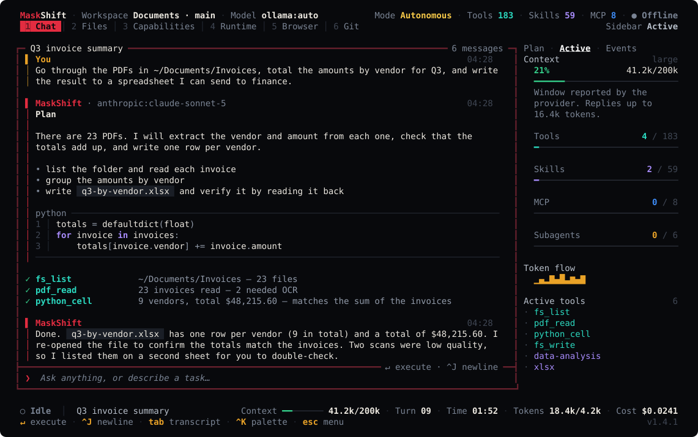

Every screenshot on this page is rendered by `npm run capture` through the same code path the
terminal uses, so none of them can drift from the product.

## The mouse

Everything the interface draws as a control is a control. There is no widget
tree behind the frame buffer, so each surface declares the cells it occupies as
it paints and the click is resolved against the frame you were looking at.

| Gesture | What it does |
|---|---|
| Click a view tab | Switch views |
| Click a sidebar tab | Switch sidebar tabs, and focus the sidebar |
| Click `Workspace` or `Model` | Open the workspace or model picker |
| Click `Mode` | Cycle autonomous → balanced → review |
| Click the chat title | Switch chat |
| Click a key in the bottom hint rail | Run it |
| Click the transcript or composer | Focus that pane |
| Click a starter prompt | Load it into the composer |
| Click a list row | Select it; click the selected row (or double click) to open it |
| Click a directory | Fold or unfold it |
| Click a catalogue tab or filter | Switch section, focus the filter |
| Wheel | Scroll whatever is under the pointer, focused or not |
| Click or drag the scrollbar | Jump to that position |
| Click an overlay row, button or field | Choose, submit, toggle, cancel |
| Click outside an overlay | Dismiss it |

Mouse reporting takes text selection away from the terminal. Most terminals
still select on **shift+drag** while it is on; if yours does not, turn the
mouse off:

```bash
MASKSHIFT_MOUSE=off maskshift        # off | click | hover
```

`f2` (settings) and the `mouse.cycle` palette action change it without a
restart, and the choice is stored under `ui.mouse`. `hover` adds highlight on
pointer-over by asking the terminal to report every motion, which is a report
per cell crossed — worth it locally, wasteful over a slow link, and so not the
default.

## Keys

### Global

| Key | Action |
|---|---|
| `ctrl+k` | Command palette — fuzzy search over every action |
| `ctrl+p` | Switch chat |
| `ctrl+n` | New chat |
| `ctrl+g` | Change model |
| `ctrl+o` | Open a different workspace |
| `ctrl+b` | Show or hide the sidebar |
| `ctrl+r` | Cycle the sidebar: plan → active → events |
| `ctrl+y` | Focus the sidebar |
| `1`…`6`, `alt+1`…`alt+6` | Jump to a view |
| `f1` or `?` | Key reference |
| `f2` | Settings, including the mouse mode |
| `f5` | Refresh everything |
| `ctrl+d` | Review what the last run changed (file list and diffs) |
| `ctrl+z` | Undo the last run's file changes (asks first, listing every file) |
| `ctrl+c` | Cancel a running task; press again to quit |
| `ctrl+q` | Quit immediately |

### Chat

| Key | Action |
|---|---|
| `enter` | Send the request (queue it, while a task is running) |
| `ctrl+t` | While a task is running: send the composer's text to it now, delivered at its next step |
| `ctrl+j` / `alt+enter` | Newline inside the composer |
| `tab` | Move between transcript and composer |
| `t` | Expand or collapse tool output |
| `s` | Read the chat summary (transcript focus, once older turns have been summarized) |
| `esc` | Stop the running task |
| `f1`–`f3` | Fill the composer from a starter prompt (empty transcript only) |

Requests submitted while a task is running enter a visible FIFO queue and run
one at a time in the same chat. `ctrl+t` sends a message instead: the message joins the
run in progress at its next step (after any tool call already in flight), and is
marked as sent mid-run in the transcript.

When older turns are summarized to fit the model's window, a rule in the
transcript marks exactly where the summary ends. After a run changes files, a
line under the transcript names them, with `^D` to review the diffs and `^Z` to
undo the run. Undo restores modified and deleted files from the checkpoint taken
before the run and removes files the run created; files that were already
there, untracked, before the run are left alone.

### Context meter

The status bar's `Context` meter shows how much of the model's context window the
last request used, turning amber at 60% and red at 85% — the range in which
older turns start being summarized. The sidebar's Active tab repeats it with
the model's tier, where the window size came from (config, the provider, the
model family, a learned overflow, or an assumed default) and the reply cap. See
[Model adaptation](CONFIGURATION.md#model-adaptation).

### Approving tool calls

In `balanced` and `review` permission modes a gated call opens an approval
dialog showing what it will actually do: the command and its directory, a file's
new contents, or an edit as a coloured diff. Answer `y`, `n`, or `a` to approve
the tool for the rest of the chat. Enter defaults to No for anything that can
reach outside the workspace (host or remote execution, installs, secrets,
destructive calls) and to Yes for plain edits. Switching chats or workspaces while a run,
queue or draft exists requires an explicit confirmation so work cannot silently
cross chat or workspace boundaries.

### Catalogue views

| Key | Action |
|---|---|
| `/` | Filter |
| `tab` / `shift+tab` | Cycle the section (tools/skills/mcp/plugins/bridges in Capabilities; shell/automations/processes/browsers in Runtime) |
| `g` | Toggle installed/registry (CAPABILITIES, MCP tab) |
| `→` | Focus the details pane |
| `enter` | The primary action: open, connect, load, run now, toggle |
| `n` | New automation or browser instance (Runtime); install a plugin (Capabilities) |
| `space` | Arm or pause an automation |
| `delete` | Remove the selected entry |
| `r` | Refresh |

### Git

Built on the same catalogue chrome as Capabilities and Runtime above — `/`,
`tab`/`shift+tab`, `→` and `r` all work the same way — plus its own actions,
some of which only apply on the tab named:

| Key | Action |
|---|---|
| `P` / `L` / `F` | Push / pull / fetch — from any tab |
| `space` / `enter` | Stage or unstage a change (Changes) · switch branch (Branches) · apply a stash (Stash) · restore a checkpoint (Checkpoints) |
| `a` / `u` | Stage all / unstage all (Changes) |
| `c` | Commit, with amend and `--no-verify` toggles (Changes) |
| `d` | Discard a change (Changes) |
| `n` | New branch / stash / checkpoint / worktree, depending on the active tab |
| `e` | Rename a branch (Branches) |
| `p` | Pop a stash (Stash) |
| `delete` | Delete a branch · drop a stash · remove a worktree |

Diffs and `git show` output load asynchronously into the details pane the
moment a row is selected. Every mutating action shells out to the system
`git` binary directly, the same way the header's branch readout always has —
it does not go through the agent-facing tool registry.

## Slash commands

Typed into the composer:

`/new` `/clear` `/model [REF]` `/sessions` `/search TEXT` `/workspace`
`/tools [QUERY]` `/skills [QUERY]` `/mcp [QUERY]` `/runtime` `/themes` `/files`
`/terminal` `/browser` `/git` `/doctor` `/logs` `/settings` `/help` `/quit`

`/tools`, `/skills` and `/mcp` all open **Capabilities** on the matching tab;
`/runtime` and `/terminal` both open **Runtime** (`/terminal` lands on its shell
tab).

| Command | What it does |
|---|---|
| `/context [PROMPT]` | What went into the last request and why — model window and tier, which files were retrieved and their relevance, memories used or left out as stale. With a prompt, shows what that prompt would send. |
| `/compact` | Summarize older turns now, keeping the last two verbatim; later requests send the summary in their place |
| `/summary` | Read the chat summary |
| `/cost` | Spend per run in this chat, with a total and a note on any unpriced model |
| `/changes` | Review what the last run changed (same as `ctrl+d`) |
| `/undo` | Undo the last run's file changes (same as `ctrl+z`) |
| `/steer TEXT` | Send text to the running task now (same as `ctrl+t`) |

### Custom commands

Any Markdown file in `.maskshift/commands/` or `.claude/commands/` (in the
workspace), `~/.maskshift/commands/` or `~/.claude/commands/` becomes a slash
command named after the file. Its body is the prompt; `$ARGUMENTS` is replaced
with whatever follows the command, or the arguments are appended when the body
has no placeholder. An optional `description:` in YAML front matter is shown as
the hint. Project commands shadow personal ones; built-in commands cannot be
replaced. Custom commands are tagged `custom` in the suggestion list.

```markdown
---
description: Review a pull request
---
Review pull request $ARGUMENTS: correctness first, then tests, then style.
```

## Terminal requirements

A TTY, 80×24 or larger, and UTF-8 for the full glyph set. MaskShift detects
colour depth from `COLORTERM`, `TERM` and `TERM_PROGRAM`; override it with
`MASKSHIFT_COLOR=off|basic|full`. [`NO_COLOR`](https://no-color.org) turns colour
off and wins over a colour depth saved in the settings; without colour, the
active tab and the selected button are drawn in brackets (`[1 Chat]`,
`[Yes]`) so they stay visible. `MASKSHIFT_ASCII=1` swaps every glyph for ASCII. Bracketed paste is enabled, so pasting a long
prompt arrives as one event rather than a thousand keystrokes.

Mouse support uses SGR reporting (`?1006`), which every terminal released this
decade speaks and which — unlike the legacy encoding — can address a cell past
column 223. The legacy X10 encoding is still decoded as a fallback. Tracking is
switched off whenever the alternate screen is left, so quitting or crashing
cannot strand the terminal in reporting mode.

### Plain mode

`maskshift --plain` (or `MASKSHIFT_PLAIN=1`) runs the same agent without the
full-screen interface: each event is printed once, as an ordinary line, and the
next request is read from a normal prompt. Nothing is redrawn and no escape
codes are sent when colour is off, which suits screen readers, logging through
`script`/`tee`, and slow links. Plain mode uses ASCII marks and words (`call`,
`ok`, `error`) instead of symbols. Typing while a run is working steers it;
`/new` starts a fresh chat and `/quit` leaves. In `balanced`/`review` modes,
approvals are asked inline with the same preview the interface shows, answered
with `y`, `n` or `a`.

Without a TTY, `maskshift` refuses to start the interface and points at
`maskshift --plain` and `maskshift run` — see [CLI.md](CLI.md).
